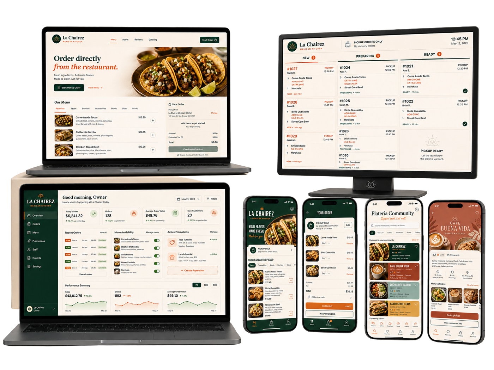
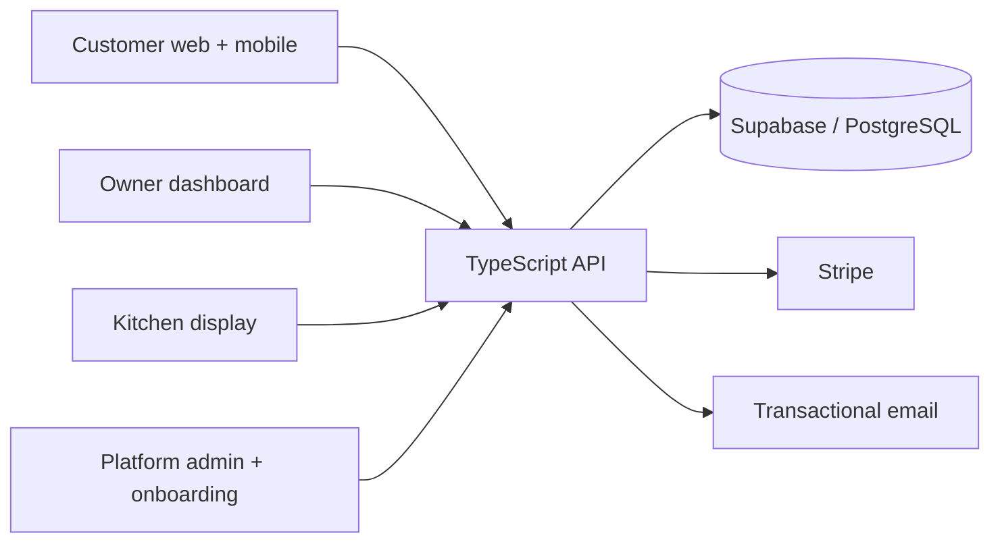
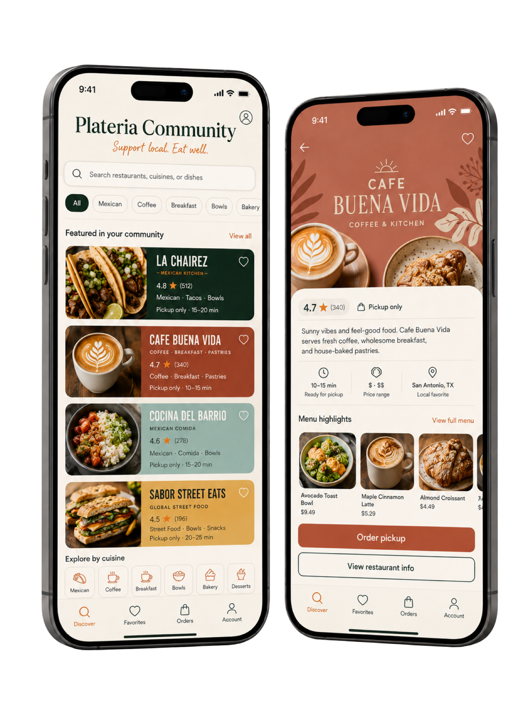

# Plateria

**A connected restaurant platform for direct ordering, daily operations, and local discovery.**

[Visit Plateria](https://plateria.co) · [Architecture](docs/architecture.md) · [Engineering approach](docs/engineering.md)

## Product overview

Plateria brings the customer and operator sides of restaurant technology into one product system. The platform is designed around direct web ordering, restaurant administration, kitchen order handling, onboarding, and a mobile community experience.

This repository is a public product and engineering showcase. The production source, infrastructure configuration, credentials, and customer data remain private.

## What I built

I designed and developed the product architecture across a TypeScript monorepo, including:

- customer web ordering and checkout flows
- an owner dashboard for restaurant operations
- a kitchen display for live order handling
- onboarding and platform administration surfaces
- a React Native mobile foundation for customer discovery and ordering
- a Node.js API with schema validation, tenant-aware data access, and test coverage
- a controlled AI-assisted engineering workflow with explicit scope, policy gates, CI evidence, and human approval

## System at a glance

The platform uses a multi-tenant data model with PostgreSQL row-level security, typed validation boundaries, and separate interfaces for customers, restaurant teams, and platform operations.

## Engineering highlights

- **Multi-surface product architecture:** focused applications for ordering, ownership, kitchen operations, onboarding, and platform administration.
- **Tenant isolation:** database constraints and row-level security designed and tested around restaurant boundaries.
- **Typed contracts:** TypeScript and Zod keep request, response, and form data explicit across the system.
- **Operational safety:** monetary values use integer cents; sensitive integrations fail closed when configuration is unavailable.
- **Tested delivery:** Vitest, Testing Library, migration checks, tenant-isolation tests, linting, builds, and diff checks.
- **Human-controlled AI automation:** structured review, bounded remediation, exact file scope, stall detection, usage limits, and a `READY FOR RYAN` handoff—never autonomous merging or deployment.

## Technology

| Layer | Technologies |
| --- | --- |
| Web products | React, TypeScript, Vite, Next.js, Tailwind CSS |
| Mobile | React Native, Expo, React Navigation |
| Backend | Node.js, Express, Zod |
| Data and auth | Supabase, PostgreSQL, row-level security |
| Commerce and messaging | Stripe, Resend |
| Quality | Vitest, Testing Library, ESLint, GitHub Actions |
| Monorepo | npm workspaces, Turborepo |

## Product visuals

### Connected restaurant operations

The system is designed as a coordinated suite rather than a collection of disconnected screens: customers order directly, restaurant teams manage the menu and business, and kitchen staff receive a purpose-built operational view.

### Community mobile experience

The mobile concept extends the platform toward local restaurant discovery and direct ordering while preserving each restaurant's identity.

## AI-assisted delivery, with guardrails

The private engineering workflow uses structured model output as evidence inside a deterministic controller. Review and remediation are separated, changes are limited to an explicit allowlist, required CI is bound to an exact commit, repeated findings trigger a mechanical stop, and only a human can approve merge or deployment.

See [the architecture note](docs/architecture.md) for the workflow and [the engineering note](docs/engineering.md) for the safety model.

## Repository boundary

This showcase intentionally contains documentation and approved public visuals only. It does **not** include production source, secrets, environment files, customer data, proprietary prompts, deployment configuration, or private repository history.

---

Built by [Ryan Lekuku](https://ryanlekuku.com) · [hello@ryanlekuku.com](mailto:hello@ryanlekuku.com)
