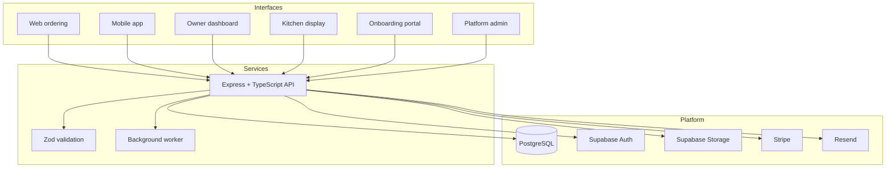
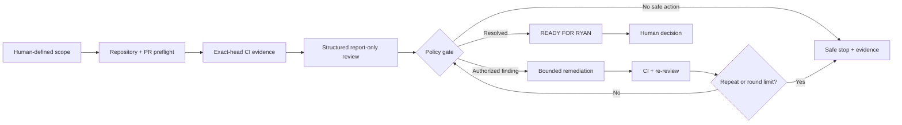

# Architecture

## Product topology

Plateria is organized as a monorepo with distinct application surfaces and shared packages. The separation keeps each interface focused while allowing validation, API clients, UI primitives, translations, and database types to evolve together.

## Tenant boundary

Restaurant identity is carried through the application and data layers. Database constraints and row-level security provide a second enforcement boundary beneath API authorization. Tenant-isolation tests exercise the two-restaurant case so access controls are verified rather than assumed.

## Controlled AI engineering loop

The controller binds work to an exact repository, pull request, base commit, head commit, allowed file set, and required check names. Model output does not grant authority: merge, deployment, credentials, and production approval stay outside the automated loop.
